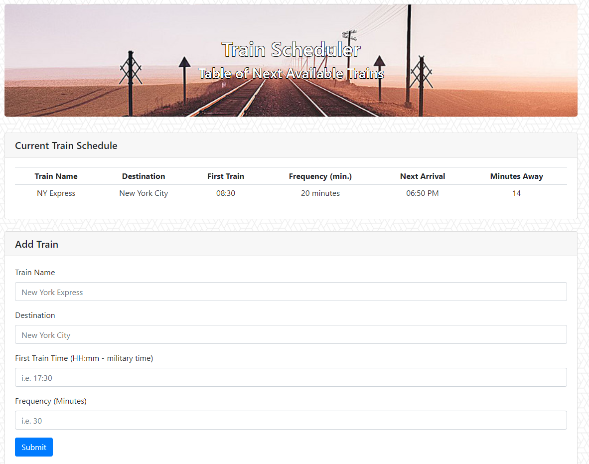

# Train Schedulers

## Description

The user enters a train name, destination, first train time, and frequency of train departures. These values are stored in a Firebase database and then called down to be displayed in the table.

The javascrip then updates to show the next train and how many minutes until the next train arrives.

**Train Scheduler Here:** https://benleone90.github.io/TrainScheduler/

## Issues

- No current issues

## Screenshot

